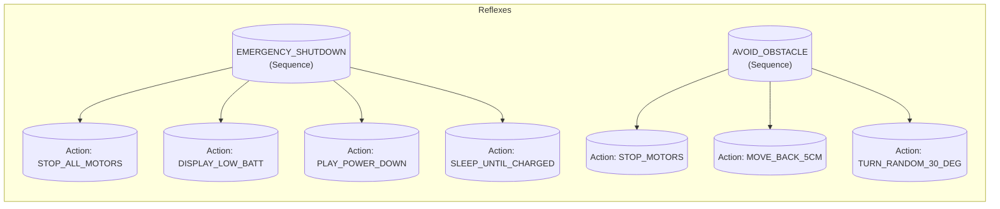
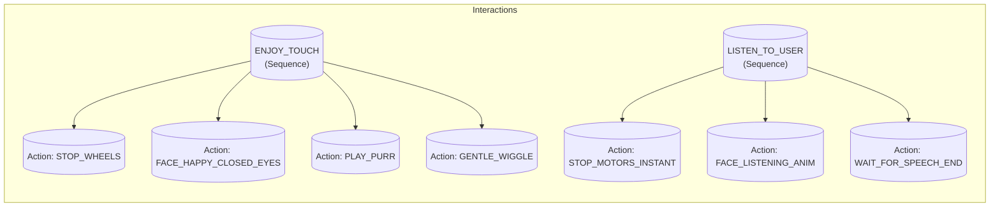
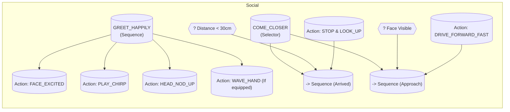
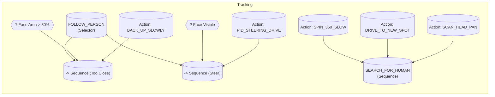
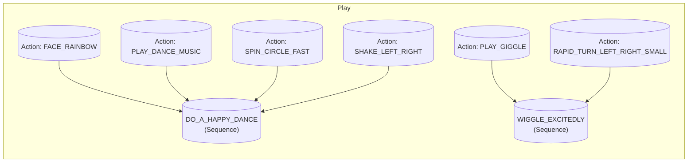
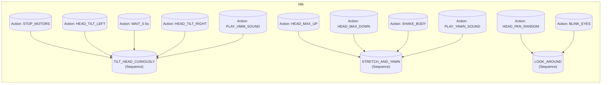

```mermaid
graph TD
    subgraph Reflexes
        direction TB
        
        %% EMERGENCY SHUTDOWN
        ShutdownRoot[("EMERGENCY_SHUTDOWN\n(Sequence)")]
        ShutdownRoot --> Stop1[("Action: STOP_ALL_MOTORS")]
        ShutdownRoot --> Face1[("Action: DISPLAY_LOW_BATT")]
        ShutdownRoot --> Sound1[("Action: PLAY_POWER_DOWN")]
        ShutdownRoot --> SleepLoop[("Action: SLEEP_UNTIL_CHARGED")]

        %% AVOID OBSTACLE
        AvoidRoot[("AVOID_OBSTACLE\n(Sequence)")]
        AvoidRoot --> Stop2[("Action: STOP_MOTORS")]
        AvoidRoot --> Back[("Action: MOVE_BACK_5CM")]
        AvoidRoot --> Turn[("Action: TURN_RANDOM_30_DEG")]
    end

```

```mermaid
graph TD
    subgraph Interactions
        direction TB
        
        %% ENJOY TOUCH (Wiggle/Purr)
        TouchRoot[("ENJOY_TOUCH\n(Sequence)")]
        TouchRoot --> Stop3[("Action: STOP_WHEELS")]
        TouchRoot --> Face2[("Action: FACE_HAPPY_CLOSED_EYES")]
        TouchRoot --> Sound2[("Action: PLAY_PURR")]
        TouchRoot --> Body[("Action: GENTLE_WIGGLE")]

        %% LISTEN (Audio Hotword)
        ListenRoot[("LISTEN_TO_USER\n(Sequence)")]
        ListenRoot --> Stop4[("Action: STOP_MOTORS_INSTANT")]
        ListenRoot --> Face3[("Action: FACE_LISTENING_ANIM")]
        ListenRoot --> Wait[("Action: WAIT_FOR_SPEECH_END")]
    end

```

```mermaid
graph TD
    subgraph Social
        direction TB
        
        %% GREET HAPPILY
        GreetRoot[("GREET_HAPPILY\n(Sequence)")]
        GreetRoot --> FaceG[("Action: FACE_EXCITED")]
        GreetRoot --> SoundG[("Action: PLAY_CHIRP")]
        GreetRoot --> HeadG[("Action: HEAD_NOD_UP")]
        GreetRoot --> Wave[("Action: WAVE_HAND (If equipped)")]

        %% COME CLOSER (Aggressive Following)
        CloserRoot[("COME_CLOSER\n(Selector)")]
        
        %% Branch 1: Arrived
        ArrivedSeq[("-> Sequence (Arrived)")]
        CloserRoot --> ArrivedSeq
        CheckDist{{"? Distance < 30cm"}} --> ArrivedSeq
        StopC[("Action: STOP & LOOK_UP")] --> ArrivedSeq
        
        %% Branch 2: Approach
        ApproachSeq[("-> Sequence (Approach)")]
        CloserRoot --> ApproachSeq
        VisCheck{{"? Face Visible"}} --> ApproachSeq
        DriveFast[("Action: DRIVE_FORWARD_FAST")] --> ApproachSeq
    end
```

```mermaid
graph TD
    subgraph Tracking
        direction TB
        
        %% FOLLOW PERSON (Polite Following)
        FollowRoot[("FOLLOW_PERSON\n(Selector)")]
        
        %% Too Close
        BackSeq[("-> Sequence (Too Close)")]
        FollowRoot --> BackSeq
        CheckClose{{"? Face Area > 30%"}} --> BackSeq
        BackAct[("Action: BACK_UP_SLOWLY")] --> BackSeq
        
        %% Steer
        SteerSeq[("-> Sequence (Steer)")]
        FollowRoot --> SteerSeq
        CheckVis{{"? Face Visible"}} --> SteerSeq
        PID[("Action: PID_STEERING_DRIVE")] --> SteerSeq

        %% SEARCH (Patrol)
        SearchRoot[("SEARCH_FOR_HUMAN\n(Sequence)")]
        Spin[("Action: SPIN_360_SLOW")] --> SearchRoot
        Move[("Action: DRIVE_TO_NEW_SPOT")] --> SearchRoot
        Scan[("Action: SCAN_HEAD_PAN")] --> SearchRoot
    end
```

```mermaid
graph TD
    subgraph Play
        direction TB
        
        %% DO A HAPPY DANCE
        DanceRoot[("DO_A_HAPPY_DANCE\n(Sequence)")]
        FaceD[("Action: FACE_RAINBOW")] --> DanceRoot
        SoundD[("Action: PLAY_DANCE_MUSIC")] --> DanceRoot
        SpinD[("Action: SPIN_CIRCLE_FAST")] --> DanceRoot
        ShakeD[("Action: SHAKE_LEFT_RIGHT")] --> DanceRoot
        
        %% WIGGLE (Stationary)
        WiggleRoot[("WIGGLE_EXCITEDLY\n(Sequence)")]
        SoundW[("Action: PLAY_GIGGLE")] --> WiggleRoot
        Shimmy[("Action: RAPID_TURN_LEFT_RIGHT_SMALL")] --> WiggleRoot
    end
```

```mermaid
graph TD
    subgraph Idle
        direction TB
        
        %% TILT HEAD (Curiosity)
        TiltRoot[("TILT_HEAD_CURIOUSLY\n(Sequence)")]
        StopT[("Action: STOP_MOTORS")] --> TiltRoot
        TiltL[("Action: HEAD_TILT_LEFT")] --> TiltRoot
        WaitT[("Action: WAIT_0.5s")] --> TiltRoot
        TiltR[("Action: HEAD_TILT_RIGHT")] --> TiltRoot
        SoundT[("Action: PLAY_HMM_SOUND")] --> TiltRoot

        %% STRETCH (Boredom)
        StretchRoot[("STRETCH_AND_YAWN\n(Sequence)")]
        HeadUp[("Action: HEAD_MAX_UP")] --> StretchRoot
        HeadDown[("Action: HEAD_MAX_DOWN")] --> StretchRoot
        Shake[("Action: SHAKE_BODY")] --> StretchRoot
        Yawn[("Action: PLAY_YAWN_SOUND")] --> StretchRoot

        %% LOOK AROUND (Passive)
        LookRoot[("LOOK_AROUND\n(Sequence)")]
        PanRand[("Action: HEAD_PAN_RANDOM")] --> LookRoot
        Blink[("Action: BLINK_EYES")] --> LookRoot
    end
```