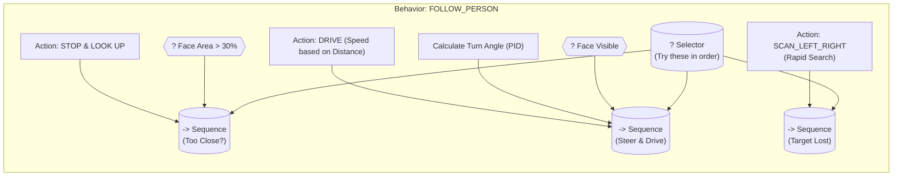
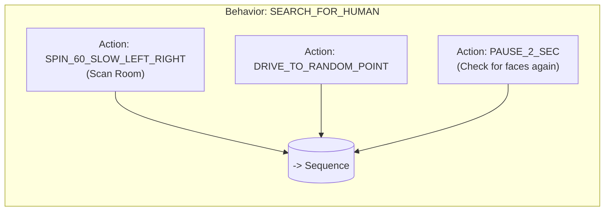
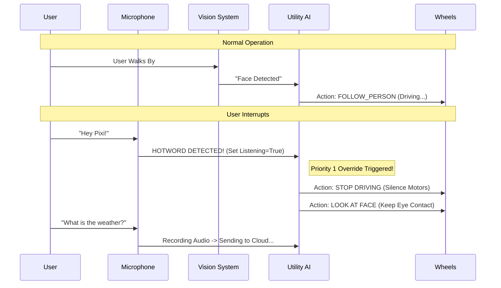

```mermaid
graph TD
    subgraph FollowLogic [Behavior: FOLLOW_PERSON]
        direction TB
        FollowRoot[("? Selector\n(Try these in order)")]
        
        %% Branch 1: Too Close (Safety Bubble)
        TooCloseSeq[("-> Sequence\n(Too Close?)")]
        FollowRoot --> TooCloseSeq
        CheckArea1{{"? Face Area > 30%"}} --> TooCloseSeq
        ActionBack["Action: STOP & LOOK UP"] --> TooCloseSeq
        
        %% Branch 2: Just Right (Steering)
        SteerSeq[("-> Sequence\n(Steer & Drive)")]
        FollowRoot --> SteerSeq
        CheckFace{{"? Face Visible"}} --> SteerSeq
        CalcPID["Calculate Turn Angle (PID)"] --> SteerSeq
        ActionTurn["Action: DRIVE (Speed based on Distance)"] --> SteerSeq
        
        %% Branch 3: Target Lost (Fallback)
        LostSeq[("-> Sequence\n(Target Lost)")]
        FollowRoot --> LostSeq
        ActionScan["Action: SCAN_LEFT_RIGHT\n(Rapid Search)"] --> LostSeq
    end

```

```mermaid

graph TD
    subgraph SearchLogic [Behavior: SEARCH_FOR_HUMAN]
        direction TB
        SearchRoot[("-> Sequence")]
        
        %% Step 1: Look around current spot
        SpinAction["Action: SPIN_60_SLOW_LEFT_RIGHT\n(Scan Room)"] --> SearchRoot
        
        %% Step 2: Drive to new vantage point
        MoveRandom["Action: DRIVE_TO_RANDOM_POINT"] --> SearchRoot
        
        %% Step 3: Wait and Listen
        WaitAction["Action: PAUSE_2_SEC\n(Check for faces again)"] --> SearchRoot
        
        %% Note: If at ANY point a face is found, 
        %% the Utility AI in Diagram 1 switches to FOLLOW_PERSON immediately.
    end

```

```mermaid
sequenceDiagram
    participant User
    participant Mic as Microphone
    participant Vis as Vision System
    participant Brain as Utility AI
    participant Motor as Wheels

    Note over User, Motor: Normal Operation
    User->>Vis: User Walks By
    Vis->>Brain: "Face Detected"
    Brain->>Motor: Action: FOLLOW_PERSON (Driving...)
    
    Note over User, Motor: User Interrupts
    User->>Mic: "Hey Pixi!"
    Mic->>Brain: HOTWORD DETECTED! (Set Listening=True)
    
    Note right of Brain: Priority 1 Override Triggered!
    Brain->>Motor: Action: STOP DRIVING (Silence Motors)
    Brain->>Motor: Action: LOOK AT FACE (Keep Eye Contact)
    
    User->>Mic: "What is the weather?"
    Mic->>Brain: Recording Audio -> Sending to Cloud...
```

